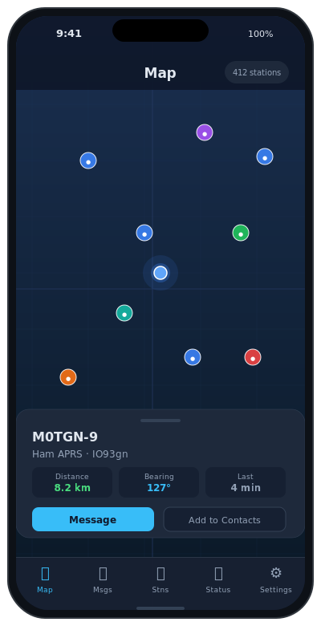
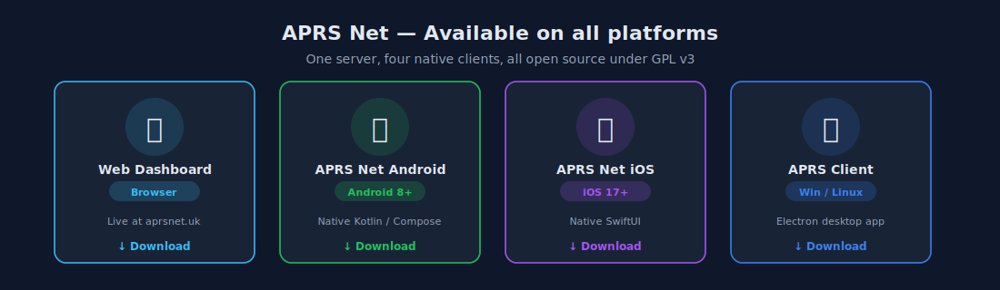

# APRS Net – iOS

Native SwiftUI client for [aprsnet.uk](https://www.aprsnet.uk) — feature-parity companion to the Android app, built for iPhone and iPad.

[](https://github.com/2E0LXY/APRS-iOS/releases)
[](https://www.gnu.org/licenses/gpl-3.0)


---

## Also available on



| Platform | Repository | Download |
|----------|------------|----------|
| **Android** | [2E0LXY/APRS-Android](https://github.com/2E0LXY/APRS-Android) | [APK](https://github.com/2E0LXY/APRS-Android/releases) |
| **Windows / Linux desktop** | [2E0LXY/APRS-Client](https://github.com/2E0LXY/APRS-Client) | [EXE / DEB](https://github.com/2E0LXY/APRS-Client/releases) |
| **Self-host the server** | [2E0LXY/Advanced-APRS-Go-server](https://github.com/2E0LXY/Advanced-APRS-Go-server) | [Install guide](https://github.com/2E0LXY/Advanced-APRS-Go-server#installation-debian-12) |

---

## Features

### 🗺 Map

- Live MapKit map with real-time APRS station annotations
- **TOCALL-based station classification** — firmware-accurate detection:
  - `APLRG*` / `APLG*` / `APLT*` / `APLO*` → LoRa iGate / tracker
  - `APZDMR*` / `APDG*` → MMDVM / DMR gateway
  - `APOG*` → OGN receiver
  - Callsign-string and symbol heuristics as fallback
- Colour-coded station pins: Ham (blue), Weather (green), Glider (orange), Ship (teal), LoRa (purple), MMDVM (red), Object (grey)
- Tap any pin to open a station detail sheet (callsign, type, coordinates, distance from your location, path)
- My Location marker; tap the locate button to zoom to your current GPS fix
- **Beacon Now** button for instant manual position transmission

### 🌊 AIS Ships

- **Server relay** — server subscribes to aisstream.io and relays live vessel positions to all clients
- **Direct connection** — optional independent aisstream.io API key in Settings; configure separately from the server key to avoid free-tier conflicts

### 💬 Messaging

- Full send/receive APRS messaging with per-callsign conversation threads
- **Direct member messaging** — when the recipient is a registered aprsnet.uk member, choose `📡 APRS` or `↗ Direct` delivery at compose time; Direct bypasses APRS-IS entirely and is delivered instantly via the server WebSocket
- Outgoing bubbles turn green on ACK confirmation; incoming messages are auto-ACKed per APRS spec
- 67-character message body limit enforced in the composer (per APRS spec)
- **Server message history sync** (v1.2.0+) — on login and on every WebSocket re-authentication, the app calls `GET /api/member/messages` and merges the full server-side history (sent and received, from all devices) into the in-memory message store; deduplication prevents doubles

### 📡 Beaconing

- GPS mode — continuous position from `CLLocationManager` at best accuracy
- Manual mode — configured lat/lon in Settings
- Off — no position reporting
- APRS position formatted to spec (DDMM.hhN/DDDMM.hhW)
- Configurable beacon comment

### 📋 Stations

- Searchable list of all heard stations with last-heard timestamp
- Station type filter chips: All / Ham / Weather / Glider / Ship / LoRa / MMDVM / Object

### ⚙️ Settings & Account

- Callsign, APRS-IS passcode, SSID (0–15)
- **Member account login** — signs in to your aprsnet.uk account; auto-fills APRS-IS passcode from the server; fetches and applies map filter preferences (`drop_pistar`, `drop_dstar`, `drop_apdesk`)
- **Real-time settings sync** (v1.2.0+) — when preferences are saved from any device (web, desktop, Android), the server pushes a `member_sync` WebSocket event; the app calls `applyServerPrefs()` immediately without re-login
- **Reconnect sync** (v1.2.0+) — on every successful WebSocket re-authentication (rate-limited to once per 5 minutes), the app re-fetches preferences and message history from the server
- Per-type map filters (7 toggles, persisted in UserDefaults)
- Direct aisstream.io API key (optional)
- **Geo-fence alerts** (v1.1.0+) — create server-side rules to fire a `UNUserNotification` when any station (or a specific callsign) enters or leaves a named geographic zone; rules sync with the server and other devices via the member API

### 📊 Status

- WebSocket connection state indicator: Connecting / Connected / Authenticated / Disconnected
- Server uptime, packet count, upstream connection status
- Current GPS position (if available)

---

## Quick Start

1. Download from [Releases](https://github.com/2E0LXY/APRS-iOS/releases)
2. Open the app → **Settings** tab
3. Enter callsign and APRS-IS passcode
4. Sign in to your aprsnet.uk member account for direct messaging and cross-device sync
5. Set beaconing mode to **GPS**
6. Tap **Save credentials** — live stations appear within seconds

---

## Requirements

- iOS 17+ / iPadOS 17+
- Xcode 15+ (to build from source)

---

## Build from Source

### Prerequisites
- macOS with Xcode 15+
- [xcodegen](https://github.com/yonaskolb/XcodeGen): `brew install xcodegen`

### Build
```bash
git clone https://github.com/2E0LXY/APRS-iOS
cd APRS-iOS
xcodegen generate --spec project.yml
open APRSNet.xcodeproj
```

Run on the iOS Simulator from Xcode, or:
```bash
xcodebuild \
  -project APRSNet.xcodeproj \
  -scheme APRSNet \
  -destination 'platform=iOS Simulator,name=iPhone 16' \
  -configuration Release \
  CODE_SIGN_IDENTITY="" CODE_SIGNING_REQUIRED=NO \
  build
```

### CI / Releases
GitHub Actions runs on every push (`macos-latest`). A `v*` tag publishes a simulator build to Releases.

> **Device / App Store deployment** requires an Apple Developer Program certificate.  
> Add `APPLE_CERTIFICATE`, `APPLE_CERTIFICATE_PASSWORD`, `APPLE_PROVISIONING_PROFILE`, `APPLE_TEAM_ID`, `ASC_API_KEY_ID`, `ASC_API_ISSUER_ID`, `ASC_API_KEY_BASE64` as repository secrets — the TestFlight workflow is in place and activates automatically once those secrets are added.

---

## Architecture

```
Sources/
  App/
    APRSNetApp.swift          — app entry point (@main)
    ContentView.swift         — TabView (Map, Messages, Stations, Settings, Status)
  Network/
    AprsWebSocket.swift       — URLSessionWebSocketTask; auth, backoff, onAuthed,
                                onMemberSync callbacks
    AisWebSocket.swift        — direct aisstream.io WebSocket connection
  APRS/
    PacketParser.swift        — position + message parsing, TOCALL classify()
  Model/
    Models.swift              — Station, APRSMessage, StationType, AlertRule
  Data/
    SettingsStore.swift       — UserDefaults persistence for all settings
  ViewModel/
    AprsViewModel.swift       — @Observable; station map, messaging, GPS, sync;
                                _lastMsgSync rate-limit for reconnect sync
    MemberLogin.swift         — /api/member/login; syncPreferencesFromServer();
                                syncMessagesFromServer(); applyServerPrefs()
  UI/
    MapScreen.swift
    Messages/
      ConversationListScreen.swift
      ThreadScreen.swift
    Stations/
      StationsScreen.swift
    Settings/
      SettingsScreen.swift
      GeoFenceScreen.swift
    Status/
      StatusScreen.swift
```

No external Swift dependencies — `URLSessionWebSocketTask` for WebSocket, `MapKit` for maps, `CoreLocation` for GPS, `UserNotifications` for alerts.

---

## Changelog

| Version | Changes |
|---------|---------|
| v1.2.0 | Cross-device sync — `syncPreferencesFromServer()` and `syncMessagesFromServer()` on login; `onMemberSync` callback applies real-time preference pushes; `onAuthed` callback triggers reconnect sync (5-min rate-limit) |
| v1.1.0 | Geo-fence alert rules — `GeoFenceScreen`, server CRUD API, WS alert → `UNUserNotificationCenter` |
| v1.0.0 | Initial release — MapKit map, messaging, GPS beaconing, direct AIS, TOCALL classification, member login, all five screens |

---

## Licence

GNU General Public Licence v3 — © 2026 Daren Loxley 2E0LXY
